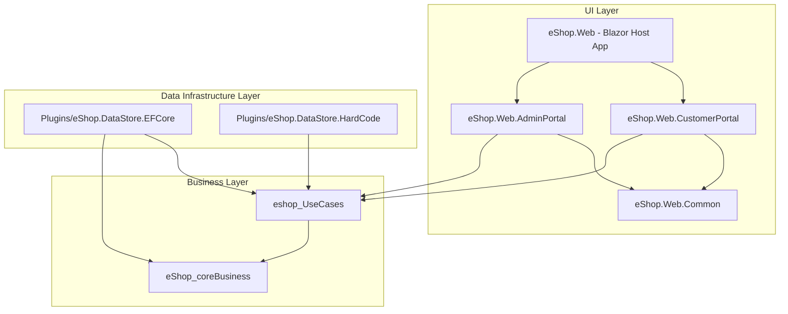

# 🛍️ eShop - Hệ Thống Thương Mại Điện Tử (.NET 8 Blazor Web App)

> **Môn học:** Học phần Lập trình Web  
> **Sinh viên thực hiện:** Lê Thị Mỹ Duyên  
> **Mã sinh viên:** 23K4080010  
> **Repository:** [lethimyduyenhth-ai/eShop](https://github.com/lethimyduyenhth-ai/eShop)

---

## 📌 Giới thiệu Dự án

**eShop** là ứng dụng thương mại điện tử hiện đại được xây dựng dựa trên công nghệ **ASP.NET Core 8 Blazor Web App**, ứng dụng kiến trúc **Clean Architecture (Onion Architecture)** kết hợp với **Entity Framework Core** và cơ sở dữ liệu **SQL Server**. 

Dự án cung cấp giải pháp bán hàng trực tuyến toàn diện bao gồm giao diện mua sắm dành cho Khách hàng (Customer Portal) và trang quản lý đơn hàng dành cho Quản trị viên (Admin Portal).

---

## 🏗️ Kiến trúc Hệ thống (Clean Architecture)

Giải pháp (Solution) được tổ chức theo các tầng phụ thuộc một chiều, đảm bảo tính mở rộng, dễ bảo trì và độc lập với các plugin dữ liệu / giao diện:



### 📂 Chi tiết các Dự án trong Solution

*   **`eShop_coreBusiness`**: Chứa các Entity cốt lõi của hệ thống (`Product`, `Order`, `OrderLineItem`) và các Domain Services (`OrderService`). Không phụ thuộc vào bất kỳ thư viện bên ngoài nào.
*   **`eshop_UseCases`**: Chứa các Use Case nghiệp vụ ứng dụng (Tìm kiếm sản phẩm, Giỏ hàng, Đặt hàng, Xử lý đơn hàng) và các giao diện Plugin Interface (`IProductRepository`, `IOrderRepository`).
*   **`Plugins/eShop.DataStore.EFCore`**: Plugin truy xuất dữ liệu chính thức qua Entity Framework Core 8 và SQL Server (`eShopContext`).
*   **`Plugins/eShop.DataStore.HardCode`**: Plugin truy xuất dữ liệu giả lập (In-Memory/Hardcoded Data) hỗ trợ kiểm thử và phát triển offline.
*   **`eShop.Web.CustomerPortal`**: Razor Class Library (RCL) đóng gói các trang và thành phần UI dành cho khách hàng (Tìm kiếm, Chi tiết sản phẩm, Giỏ hàng, Thanh toán, Xác nhận đơn hàng).
*   **`eShop.Web.Modules/eShop.Web.AdminPortal`**: Razor Class Library (RCL) đóng gói các trang quản trị (Quản lý đơn hàng chưa xử lý, Xem thông tin chi tiết đơn hàng và Xử lý đơn hàng).
*   **`eShop.Web.Modules/eShop.Web.Common`**: Đóng gói các UI Control dùng chung (Thanh tìm kiếm `SearchBarComponent`).
*   **`eShop.Web`**: Dự án ASP.NET Core 8 Blazor Host đóng vai trò làm điểm khởi chạy (Host), đăng ký Dependency Injection, xác thực Cookie Authentication và định tuyến trang.

---

## 🚀 Tính năng Nổi bật

### 🛒 1. Cổng Khách Hàng (Customer Portal)
- **Tìm kiếm sản phẩm**: Tìm kiếm sản phẩm theo từ khóa linh hoạt.
- **Xem chi tiết sản phẩm**: Hiển thị đầy đủ hình ảnh, giá cả, mô tả sản phẩm.
- **Quản lý Giỏ hàng (Shopping Cart)**:
  - Thêm sản phẩm vào giỏ hàng.
  - Cập nhật số lượng hoặc xóa sản phẩm khỏi giỏ hàng.
  - Tự động tính tổng tiền giỏ hàng.
  - Hiển thị badge số lượng sản phẩm trên thanh điều hướng (`NavMenu`).
- **Đặt hàng (Checkout)**: Nhập thông tin người mua (Họ tên, Địa chỉ, Số điện thoại) và xác nhận đặt hàng.
- **Xác nhận đơn hàng**: Hiển thị hóa đơn xác nhận sau khi đặt hàng thành công.

### 🛡️ 2. Cổng Quản Trị (Admin Portal)
- **Xác thực Đăng nhập (Authentication)**: Đăng nhập hệ thống qua trang `/login` hỗ trợ Cookie Authentication.
- **Quản lý Đơn hàng chờ xử lý (`/admin` / `/outstandingorders`)**:
  - Lọc và hiển thị danh sách các đơn hàng chưa được xử lý.
  - Xem chi tiết thông tin khách hàng và các sản phẩm trong đơn hàng via Modal popup.
  - **Xử lý đơn hàng (Process Order)**: Cập nhật trạng thái đơn hàng thành đã xử lý.

---

## 🛠️ Công nghệ Sử dụng

*   **Language & Framework**: C# 12, .NET 8 (ASP.NET Core Blazor Web App)
*   **Render Mode**: Blazor Interactive Server
*   **Architecture**: Clean Architecture / Plugin-based Architecture
*   **ORM**: Entity Framework Core 8
*   **Database**: Microsoft SQL Server / LocalDB
*   **UI Framework**: Bootstrap 5, Razor Components & Razor Class Libraries (RCL)
*   **Authentication**: Cookie-based Authentication & Minimal APIs

---

## 📁 Cấu trúc Thư mục Repository

```text
eShop/
├── .github/                         # GitHub Configurations
├── eShop.sln                        # Visual Studio Solution File
├── eShop_coreBusiness/              # Domain Layer (Entities & Domain Logic)
│   ├── models/                      # Product, Order, OrderLineItem
│   └── services/                    # OrderService, IOrderService
├── eshop_UseCases/                  # Application Use Cases Layer
│   ├── AdminPortalScreen/           # Admin Use Cases
│   ├── OrderConfirmationScreen/     # Order Confirmation Use Cases
│   ├── PluginInterfaces/            # Repository Interfaces (IProductRepository, IOrderRepository)
│   ├── SearchProductScreen/         # Search Product Use Cases
│   ├── ShoppingCartScreen/          # Shopping Cart & Checkout Use Cases
│   └── ViewProductScreen/           # View Product Details Use Cases
├── Plugins/                         # Data Access Infrastructure Plugins
│   ├── eShop.DataStore.EFCore/      # EF Core & SQL Server Data Access
│   └── eShop.DataStore.HardCode/    # In-Memory / Mock Data Store
└── eShop.Web/                       # Web Host & Component Modules
    ├── eShop.Web/                   # Main ASP.NET Core 8 Host Application
    ├── eShop.Web.CustomerPortal/    # Customer UI Razor Class Library
    └── eShop.Web.Modules/
        ├── eShop.Web.AdminPortal/   # Admin UI Razor Class Library
        └── eShop.Web.Common/        # Common UI Controls Razor Class Library
```

---

## 💻 Hướng dẫn Cài đặt & Khởi chạy

### 📋 Yêu cầu Tiền đề
- **.NET 8 SDK** (phiên bản 8.0 trở lên)
- **Visual Studio 2022** (với workload *ASP.NET and web development*) hoặc **VS Code**
- **SQL Server** (SQL Server Express, LocalDB, hoặc Docker SQL Server Container)

### 🚀 Các bước Thực hiện

1. **Clone Repository**:
   ```bash
   git clone https://github.com/lethimyduyenhth-ai/eShop.git
   cd eShop
   ```

2. **Cấu hình Chuỗi kết nối Cơ sở dữ liệu (Connection String)**:
   Mở file `eShop.Web/appsettings.json` và điều chỉnh chuỗi kết nối phù hợp với máy cục bộ của bạn:
   ```json
   "ConnectionStrings": {
     "eShop": "Server=localhost;Database=eShop;Trusted_Connection=True;MultipleActiveResultSets=true;TrustServerCertificate=True"
   }
   ```

3. **Khởi chạy Ứng dụng**:
   Sử dụng lệnh CLI hoặc bấm **F5** trong Visual Studio:
   ```bash
   dotnet run --project eShop.Web
   ```

4. **Truy cập Ứng dụng**:
   - Giao diện Khách hàng: `https://localhost:7024` hoặc `http://localhost:5000`
   - Giao diện Quản trị viên: `https://localhost:7024/admin` (hoặc đăng nhập tại `https://localhost:7024/login`)

> 💡 **Ghi chú**: Cơ sở dữ liệu SQL Server sẽ tự động được khởi tạo và nạp dữ liệu mẫu ban đầu (`EnsureCreated`) trong lần chạy ứng dụng đầu tiên.

---

## 🔑 Tài khoản Mẫu & Phân quyền

*   **Trang Đăng nhập Quản trị**: `/login`
*   **Tài khoản Mặc định**:
    *   **Username**: `admin` (hoặc nhập bất kỳ tên người dùng nào)
    *   **Password**: *Không bắt buộc mật khẩu cụ thể trong phiên bản demo*
    *   **Quyền hạn**: Hệ thống tự động gán **Role Admin** để cho phép truy cập trang quản lý đơn hàng `/admin`.

---

## 📝 Thông tin Đồ án / Học phần

*   **Tên dự án**: eShop - Hệ Thống Thương Mại Điện Tử
*   **Học phần**: Lập trình Web
*   **Sinh viên thực hiện**: Lê Thị Mỹ Duyên
*   **Mã sinh viên**: 23K4080010
*   **Repository**: [lethimyduyenhth-ai/eShop](https://github.com/lethimyduyenhth-ai/eShop)
